# Mechanical Counter

This project features a fully functional, 3D-printable mechanical counter, designed entirely in Autodesk Fusion 360. Inspired by classic odometers, the mechanism relies on a system of spur gears, a pawl, and an actuator to sequentially count inputs.

## Inspiration & Ideas

* [https://www.printables.com/model/718967-mechanical-counter]
* [https://www.youtube.com/watch?v=rjWfIiaOFR4]

## How it Works

* **The Input:** The core mechanism is driven by a linear actuator. When pressed, it pushes a driving pawl that engages with the teeth of the unit gear, advancing it by one position.
* **The Transfer:** Once the unit gear completes a full rotation (reaching 9), a smaller transfer gear engages the next gear in line (the tens, and subsequently the hundreds), successfully incrementing the total count.

## Resources Used

To design, simulate, and document this mechanical counter, the following resources and tools were utilized:

* **CAD Software:** Autodesk Fusion 360 - Used for all 3D modeling, joint assembly, and motion study simulations.
* **Mechanical Inspiration:** Reference materials and diagrams of classic mechanical odometers and ratcheting mechanisms.
* **3D Printing / Slicing:** PrusaSlicer - Used for preparing and slicing the models for FDM 3D printing.

## Simulation & Kinematics

The Fusion 360 assembly includes fully configured **Motion Links** and a **Motion Study** to accurately visualize the mechanism's real-world behavior:
* The timeline is animated so that every 3 frames, the unit gear rotates exactly **36 degrees** (incrementing one number).
* Through the defined Motion Links, the gear ratios are mathematically constrained. The tens gear moves at a **1/10** ratio, and the hundreds gear moves at a **1/100** ratio relative to the unit gear's rotation, perfectly simulating the mechanical carry-over.

## Design for Manufacturing

The model has been optimized for FDM 3D printing. Clearances have been carefully considered, and key components—such as the pins, gear faces, and inner rotational holes—feature chamfers. This design choice mitigates the "elephant's foot" effect on the first printed layer, ensuring smooth assembly and frictionless rotation without the need for heavy post-processing.

## Hardware Requirements

While all structural parts and gears are entirely 3D printed, the mechanism requires one piece of external hardware to function perfectly:
* **1x Metal compression spring** (approx. 2.6mm diameter, 65mm height). This must be placed on the actuator shaft to push the driving mechanism back to its resting position after each press.

## Components List

Here is a detailed breakdown of all the 3D printed components required for this assembly:

* **Actuator (Slider):** The primary input mechanism. It slides vertically within the frame to drive the mechanism forward.
  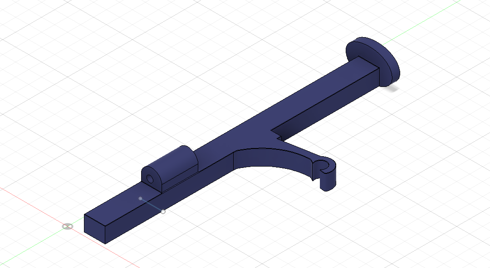

* **Driving Pawl (Piedica):** The ratcheting arm that interacts with the unit gear's teeth to advance it by one position per press.
  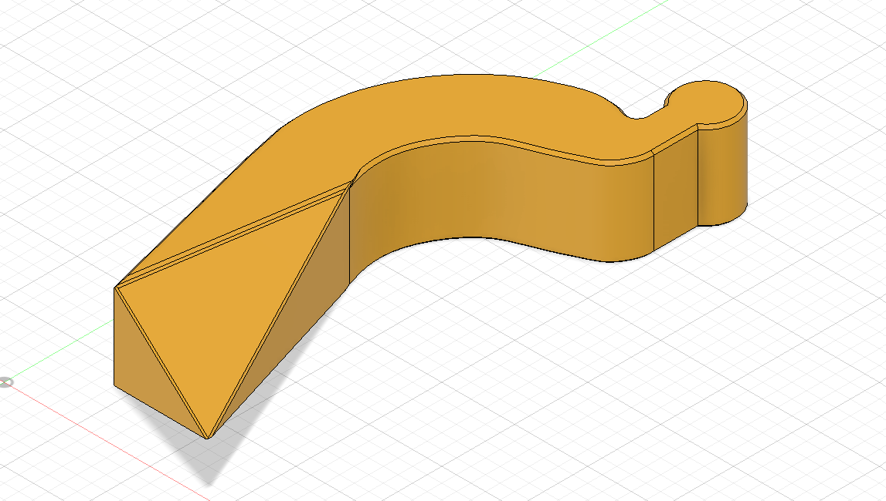

* **Units Gear (Roata Unitati):** The first numerical wheel (0-9). It receives the direct input from the actuator's pawl.
  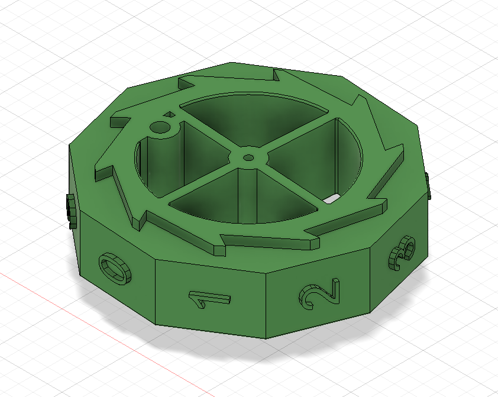

* **Tens & Hundreds Gears (Roti Zeci & Sute):** The subsequent numerical wheels that are incrementally driven by the transfer gears to count higher digits.
  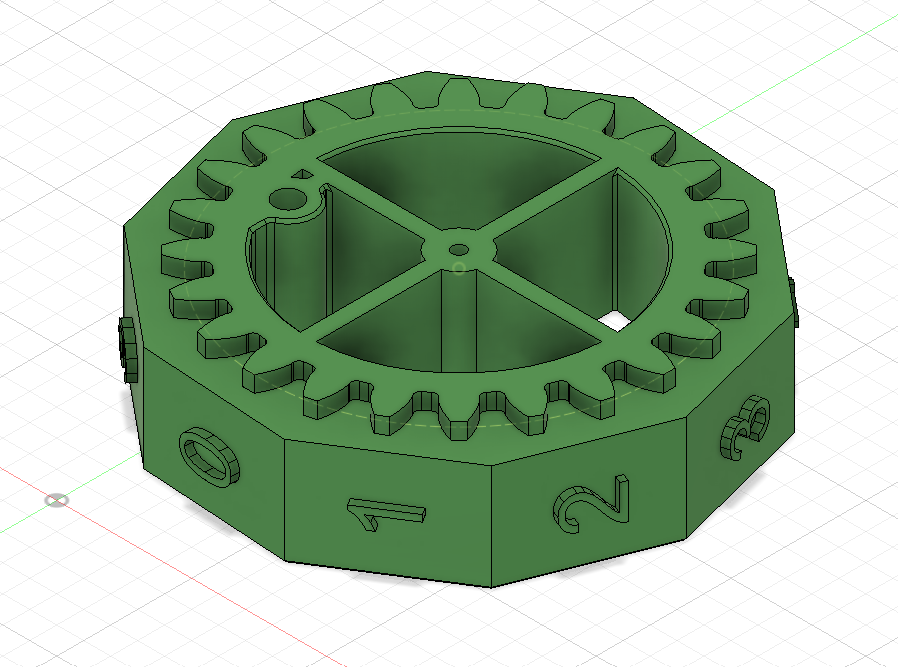

* **Transfer Gear (Roata Mica / Pinion):** The small intermediate gear responsible for the carry-over mechanism. It automatically turns the next wheel when the previous one completes a full rotation.
  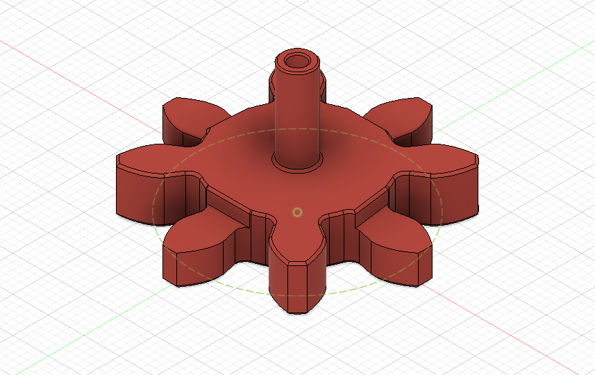

* **Main Shaft (Tija):** The central axis rod on which the main number gears freely rotate.
  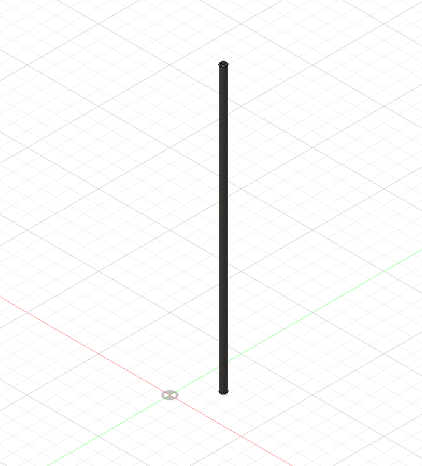

* **Spacer (Distantier):** Placed on the shafts to ensure the gears maintain the correct distance and alignment from each other.
  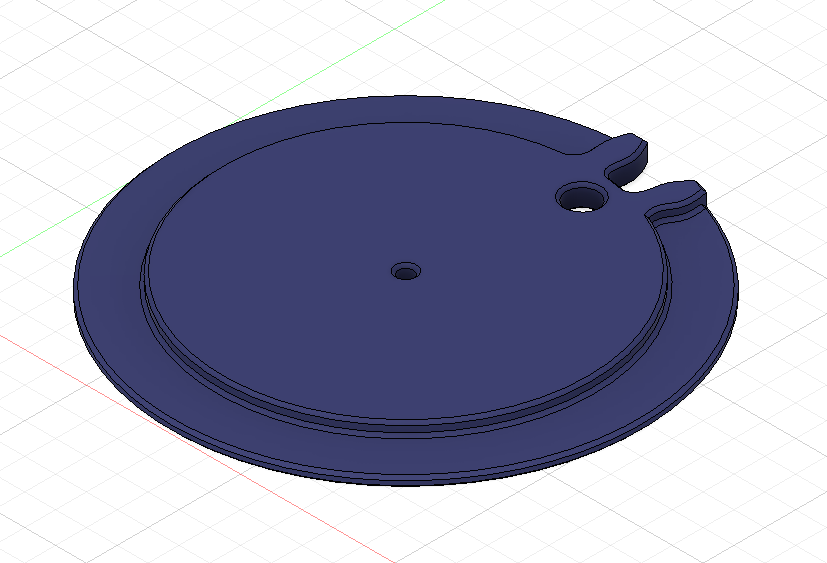

* **Pin:** Small connectors used for securing and aligning the frame components together.
  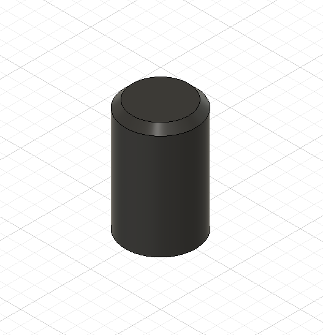

* **Display Window (Cadran Numere):** The cover panel that frames the numbers so the current count can be easily read.
  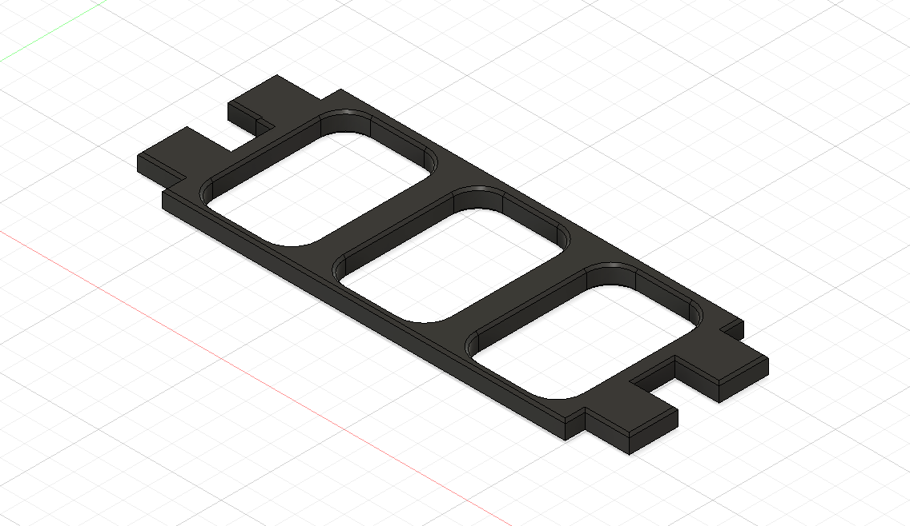

* **Left Frame Panel (Rama Stanga):** The left-side structural wall of the housing, which also guides the actuator.
  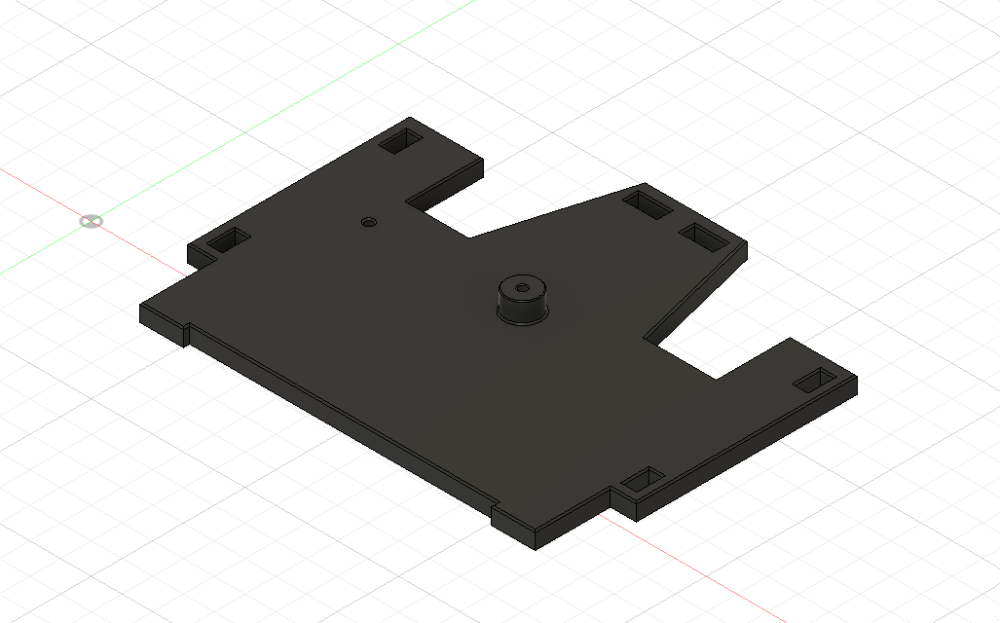

* **Right Frame Panel (Rama Dreapta):** The right-side structural wall of the housing.
  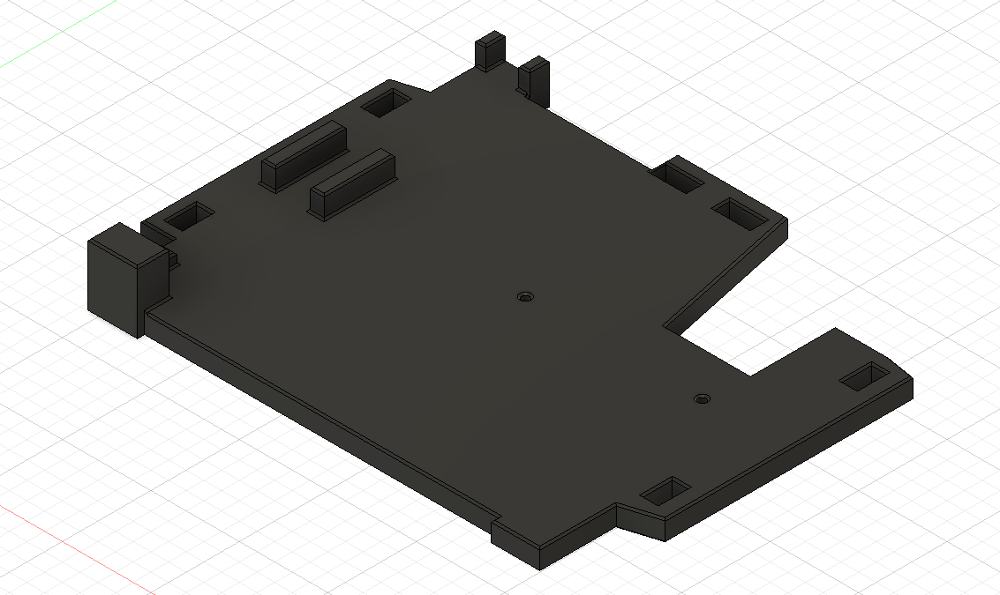

* **Front & Back Frame Panels (Rama Fata/Spate):** The structural plates that enclose and secure the entire mechanism from the front and rear.
  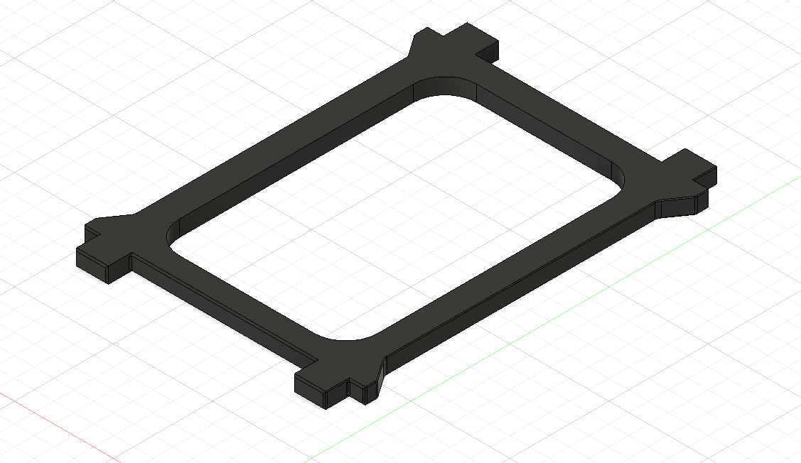

  ## Full Assembly Views

Below are several views of the fully assembled mechanical counter, showcasing how all the components fit and interact together:

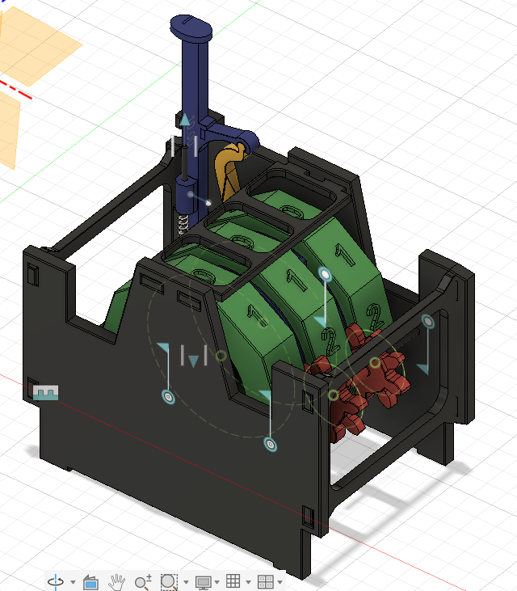

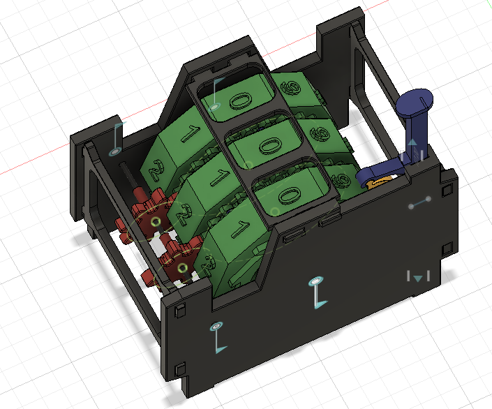

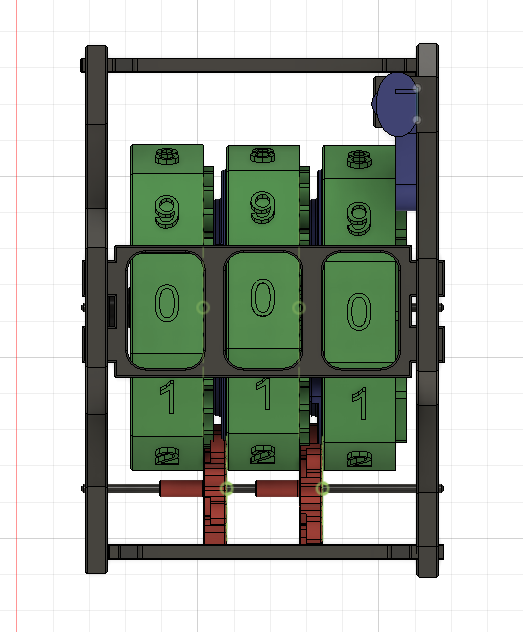

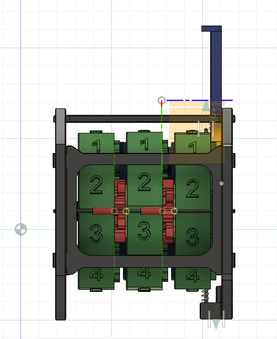

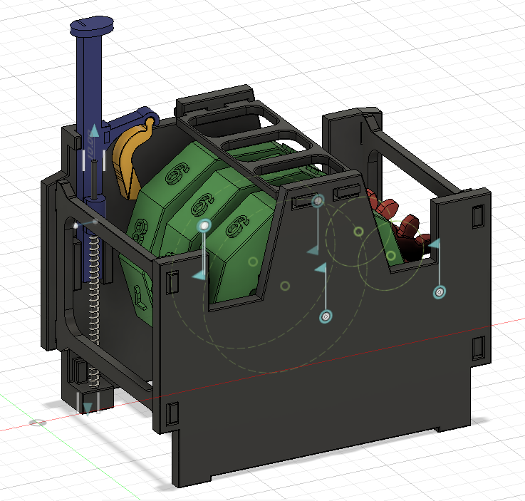

## Conclusion & Limitations

**Conclusion**
This project successfully demonstrates the design, simulation, and assembly of a 3D-printable mechanical counter. By utilizing Fusion 360's precise modeling and motion studies, combined with careful DfAM (Design for Additive Manufacturing) considerations, the resulting mechanism effectively replicates a classic odometer system using basic printed parts and a single metal spring. 

**Limitations: Manual Reset**
The primary limitation of this current iteration is the absence of an automatic or mechanical reset button. The counter is designed strictly for continuous upward incrementing. 

Because there is no dedicated reset lever, returning the counter to zero requires manual intervention:
* The user must physically lift and hold the actuator in its highest upward position. This ensures the driving pawl is disengaged from the gears.
* While holding the actuator up, the user must manually rotate each individual number gear by hand until the top display window perfectly aligns to read **"0, 0, 0"**.
